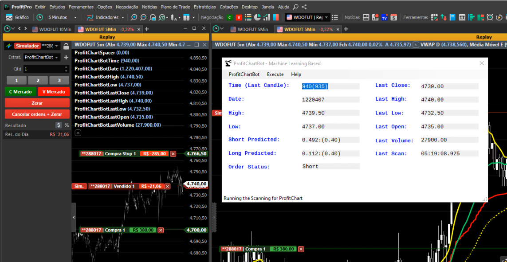

# pyAutoTrader

The program aims to function as an automated trading bot with capabilities for training ML models and executing trades. It operates in two modes: training and inference. In the training mode, it runs a series of Python notebooks to clean, normalize, and train data using the XGBoost algorithm (Boosted Gradient Trees). In the inference mode, it operates as a web server where features can be posted, and it returns whether it's a Long or Short operation.

## Data Model

For both training and inference, we utilize the "DataFrame" model, consisting of a candlestick, its previous 11 candles, and corresponding indicators (previous trading day OHLC, Moving Averages, etc.).

During XGBoost model training, we prepare this dataframe for each candle. Additionally, when inferring whether a certain candle represents a Long or Short Trade Signal, we POST this dataframe to the FastAPI server.

Below is a graphical representation of the data within the dataframe.


Furthermore, below are the fields used to represent the aforementioned dataframe:

```python
FULL_FEATURE_LIST = list(
{'x0_roc', 'x0_previous_high', 'x0_previous_low', 'x0_previous_close', 'x0_previous_open', 'x0_ema9_close',
'x0_ema21_close', 'x0_ema55_close', 'x0_ema144_close', 'x0_ema233_close', 'x1_roc', 'x1_previous_high',
'x1_previous_low', 'x1_previous_close', 'x1_previous_open', 'x1_ema9_close', 'x1_ema21_close', 'x1_ema55_close',
'x1_ema144_close', 'x1_ema233_close', 'x1_x0_close', 'x1_x0_high', 'x1_x0_low', 'x2_roc', 'x2_previous_high',
'x2_previous_low', 'x2_previous_close', 'x2_previous_open', 'x2_ema9_close', 'x2_ema21_close', 'x2_ema55_close',
'x2_ema144_close', 'x2_ema233_close', 'x2_x1_close', 'x2_x1_high', 'x2_x1_low', 'x3_roc', 'x3_previous_high',
'x3_previous_low', 'x3_previous_close', 'x3_previous_open', 'x3_ema9_close', 'x3_ema21_close', 'x3_ema55_close',
'x3_ema144_close', 'x3_ema233_close', 'x3_x2_close', 'x3_x2_high', 'x3_x2_low', 'x4_roc', 'x4_previous_high',
'x4_previous_low', 'x4_previous_close', 'x4_previous_open', 'x4_ema9_close', 'x4_ema21_close', 'x4_ema55_close',
'x4_ema144_close', 'x4_ema233_close', 'x4_x3_close', 'x4_x3_high', 'x4_x3_low', 'x5_roc', 'x5_previous_high',
'x5_previous_low', 'x5_previous_close', 'x5_previous_open', 'x5_ema9_close', 'x5_ema21_close', 'x5_ema55_close',
'x5_ema144_close', 'x5_ema233_close', 'x5_x4_close', 'x5_x4_high', 'x5_x4_low', 'x6_roc', 'x6_previous_high',
'x6_previous_low', 'x6_previous_close', 'x6_previous_open', 'x6_ema9_close', 'x6_ema21_close', 'x6_ema55_close',
'x6_ema144_close', 'x6_ema233_close', 'x6_x5_close', 'x6_x5_high', 'x6_x5_low', 'x7_ema9', 'x7_ema21', 'x7_ema55',
'x7_ema144', 'x7_ema233', 'x7_ema9', 'x7_ema21', 'x7_ema55', 'x7_ema144', 'x7_ema233', 'x7_open', 'x7_high',
'x7_low', 'x7_close', 'x7_volume', 'x7_open', 'x7_high', 'x7_low', 'x7_close', 'x7_height', 'x7_body', 'x7_roc',
'x7_previous_high', 'x7_previous_low', 'x7_previous_close', 'x7_previous_open', 'x7_ema9_close', 'x7_ema21_close',
'x7_ema55_close', 'x7_ema144_close', 'x7_ema233_close', 'x7_x6_close', 'x7_x6_high', 'x7_x6_low', 'x8_roc',
'x8_previous_high', 'x8_previous_low', 'x8_previous_close', 'x8_previous_open', 'x8_ema9_close', 'x8_ema21_close',
'x8_ema55_close', 'x8_ema144_close', 'x8_ema233_close', 'x8_x7_close', 'x8_x7_high', 'x8_x7_low', 'x9_roc',
'x9_previous_high', 'x9_previous_low', 'x9_previous_close', 'x9_previous_open', 'x9_ema9_close', 'x9_ema21_close',
'x9_ema55_close', 'x9_ema144_close', 'x9_ema233_close', 'x9_x8_close', 'x9_x8_high', 'x9_x8_low', 'x10_roc',
'x10_previous_high', 'x10_previous_low', 'x10_previous_close', 'x10_previous_open', 'x10_ema9_close',
'x10_ema21_close', 'x10_ema55_close', 'x10_ema144_close', 'x10_ema233_close', 'x10_x9_close', 'x10_x9_high',
'x10_x9_low', 'x11_roc', 'x11_previous_high', 'x11_previous_low', 'x11_previous_close', 'x11_previous_open',
'x11_ema9_close', 'x11_ema21_close', 'x11_ema55_close', 'x11_ema144_close', 'x11_ema233_close', 'x11_x10_close',
'x11_x10_high', 'x11_x10_low', 'previous_close', 'previous_high', 'previous_low', 'previous_open', 'x0_ema55',
'x0_ema144', 'x0_ema233', 'x1_ema55', 'x1_ema144', 'x1_ema233', 'x2_ema55', 'x2_ema144', 'x2_ema233', 'x3_ema55',
'x3_ema144', 'x3_ema233', 'x4_ema55', 'x4_ema144', 'x4_ema233', 'x5_ema55', 'x5_ema144', 'x5_ema233', 'x6_ema55',
'x6_ema144', 'x6_ema233', 'x7_ema55', 'x7_ema144', 'x7_ema233', 'x8_ema55', 'x8_ema144', 'x8_ema233', 'x9_ema55',
'x9_ema144', 'x9_ema233', 'x10_ema55', 'x10_ema144', 'x10_ema233', 'x11_ema55', 'x11_ema144', 'x11_ema233',
'x0_body', 'x0_close', 'x0_ema21', 'x0_ema9', 'x0_height', 'x0_high', 'x0_low', 'x0_open', 'x0_volume', 'x10_body',
'x10_close', 'x10_ema21', 'x10_ema9', 'x10_height', 'x10_high', 'x10_low', 'x10_open', 'x10_volume', 'x11_body',
'x11_close', 'x11_close_slope', 'x11_ema21', 'x11_ema9', 'x11_height', 'x11_high', 'x11_high_slope', 'x11_low',
'x11_low_slope', 'x11_open', 'x11_volume', 'x11_volume_slope', 'x1_body', 'x1_close', 'x1_ema21', 'x1_ema9',
'x1_height', 'x1_high', 'x1_low', 'x1_open', 'x1_volume', 'x2_body', 'x2_close', 'x2_ema21', 'x2_ema9',
'x2_height', 'x2_high', 'x2_low', 'x2_open', 'x2_volume', 'x3_body', 'x3_close', 'x3_ema21', 'x3_ema9',
'x3_height', 'x3_high', 'x3_low', 'x3_open', 'x3_volume', 'x4_body', 'x4_close', 'x4_ema21', 'x4_ema9',
'x4_height', 'x4_high', 'x4_low', 'x4_open', 'x4_volume', 'x5_body', 'x5_close', 'x5_ema21', 'x5_ema9',
'x5_height', 'x5_high', 'x5_low', 'x5_open', 'x5_volume', 'x6_body', 'x6_close', 'x6_ema21', 'x6_ema9',
'x6_height', 'x6_high', 'x6_low', 'x6_open', 'x6_volume', 'x7_body', 'x7_close', 'x7_ema21', 'x7_ema9',
'x7_height', 'x7_high', 'x7_low', 'x7_open', 'x7_volume', 'x8_body', 'x8_close', 'x8_ema21', 'x8_ema9',
'x8_height', 'x8_high', 'x8_low', 'x8_open', 'x8_volume', 'x9_body', 'x9_close', 'x9_ema21', 'x9_ema9',
'x9_height', 'x9_high', 'x9_low', 'x9_open', 'x9_volume', 'current_bar_in_date', "x0_vwap", "x1_vwap", "x2_vwap",
"x3_vwap", "x4_vwap", "x5_vwap", "x6_vwap", "x7_vwap", "x8_vwap", "x9_vwap", "x10_vwap", "x11_vwap"})
```

Please notice that the quotes have been normalized, so instead of having a quote with the absolute price, we use the percentual variation in relation to the close price of the target candlestick

## Hyperparameters and Model Output

XGBoost is a algorithm that generates a decision tree that tries to predict if when certain numerical features are within a certain range, they present a "probability"  that a certain outcome is possible or not, so, something like the model generated below:

```python
def process_long(cond):
    final_res=0.5

    final_res+=(0.0972686261 if (cond['x9_previous_high']<1.76160121) and (cond['x11_height']<0.148379788) and (cond['x11_height']<-0.145042777) and (cond['x11_height']<-0.21536532) and (cond['x3_previous_low']<-1.71445251) else 0.0 )
    final_res+=(-0.123476721 if (cond['x9_previous_high']<1.76160121) and (cond['x11_height']<0.148379788) and (cond['x11_height']<-0.145042777) and (cond['x11_height']<-0.21536532) and not (cond['x3_previous_low']<-1.71445251) else 0.0 )
    final_res+=(-0.0554996096 if (cond['x9_previous_high']<1.76160121) and (cond['x11_height']<0.148379788) and (cond['x11_height']<-0.145042777) and not (cond['x11_height']<-0.21536532) and (cond['x7_height']<-0.173613116) else 0.0 )
    final_res+=(-0.295924634 if (cond['x9_previous_high']<1.76160121) and (cond['x11_height']<0.148379788) and (cond['x11_height']<-0.145042777) and not (cond['x11_height']<-0.21536532) and not (cond['x7_height']<-0.173613116) else 0.0 )
    final_res+=(-0.421801716 if (cond['x9_previous_high']<1.76160121) and (cond['x11_height']<0.148379788) and not (cond['x11_height']<-0.145042777) and (cond['x2_previous_close']<-0.232456565) and (cond['x4_ema55_close']<-0.313315094) else 0.0 )

    return final_res
```

Where we can see that each range of values in the features, add or subtract possibilities for the final response be positive ( > 0 ) or negative ( < 0 )

In order for us to run the training, we need some parameters to be set as env. parameters which will inform the location of the input and output data, the accepted target and loss of the model and many other parameters:

```bash
TRADE_DAY_START=900 # The Time in which the trading day starts, in this case: 09:00 AM
MINIMUM_TIME=930 # When it is safe to start to execute trading operations ( Avoid Opening Orders )
MAXIMUM_TIME=1350 # When we should stop the trading day, in this case: 1:50 PM
MINIMUM_DATE_DATAFRAME=20180301 # The Minimun date to start the trading day, ( in this case, 2018-03-01 )
MINIMUM_DATE_TRADE=20180315 # When we should start training? ( in this case, 2018-03-15 )
MAX_TRAIN_DATE=20210830 # When we should stop training? ( in this  case, 2021-08-30 )
MAX_TRADE_DURATION=24 # The Max duration of a trade operation ( in candles )
CURRENT_TARGET=0.8 # The Current Gain Target, in percent
CURRENT_STOP=0.4 # The Current Maximum Loss, in percent
DECISION_BOUNDARY=0.4 # The score from the XGBoost Model, from which we should consider a Long or Short Signal
CURRENT_EXCHANGE='B3' # The Exchange Code, right now it is only supported Brazilian B3 
CURRENT_ASSET='WDO' # The Asset Code, Dollar Futures mini-contracts
CURRENT_TIMEFRAME='5Min' # The current time frame 
NUM_TREES=120 # The Max number of Decision trees in the XGBoost 
TREE_DEPTH=5 # The Maximum Depth for each decision tree
WEIGHT_RATIO=0.8 # These is used to balance the target classes
CURRENT_DAILY_FILE_CSV='WDO$Daily.csv' # The daily input file with the quotes in OHLC format
CURRENT_5MIN_FILE_CSV='WDO$M5.csv' # The 5min input file with the quotes in OHLC format
DATA_INPUT_DIR=../00.data/input # The folder containing input data
DATA_OUTPUT_DIR=../00.data/output # The folder for the output data
IS_HYPER_PARAMETER_SEARCH=False # Are we going to use hyper parameter search?
NUM_FOLDS_CROSSVALIDATION=10 # How many times should we shuffle the input data and cross fold it between train and validation?
DATA_HYPERPARAMETERS_DIR=../00.data/hyperparameters # The folder for the hyperparameters search result
```



